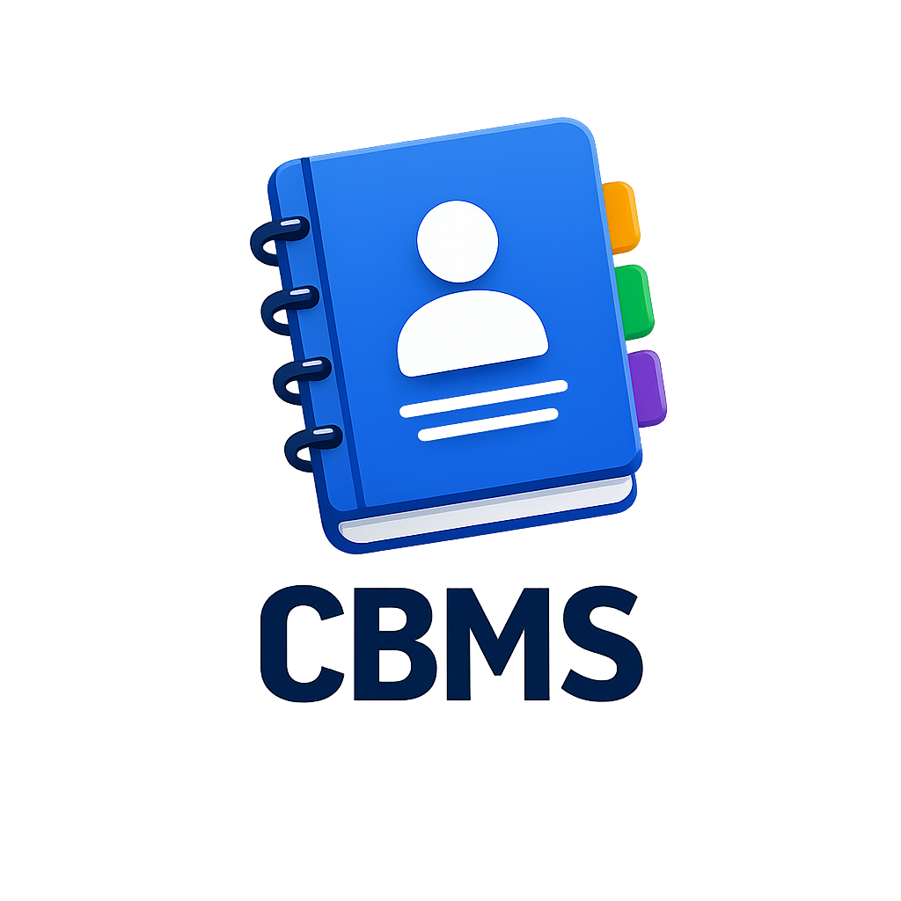
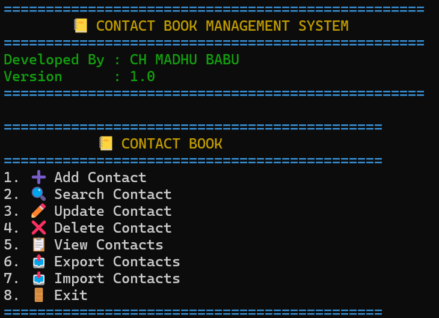
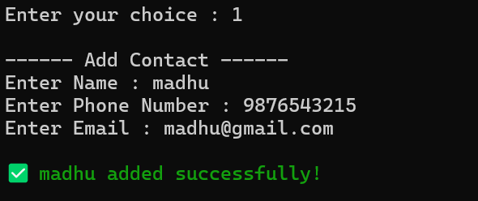
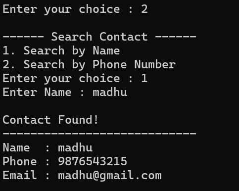
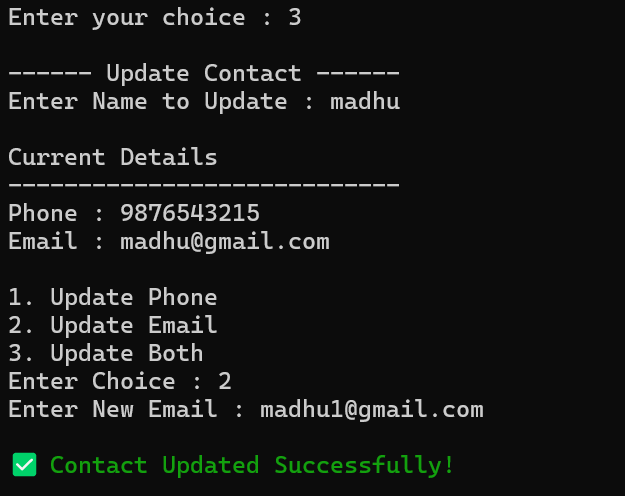
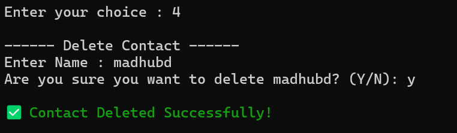
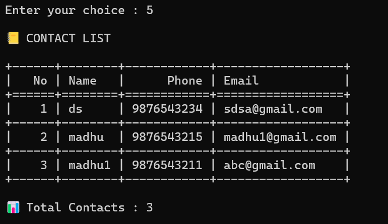
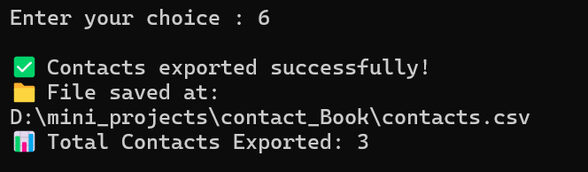

<div align="center">

# 📒 Contact Book Management System



A modular Python application for efficiently managing contacts with JSON-based storage, CSV import/export, and a clean command-line interface.


</div>

---

# 📖 Project Overview

The **Contact Book Management System** is a modular Python application that allows users to manage contacts through a menu-driven command-line interface.

The project demonstrates clean software architecture by separating validation, file handling, contact management, and user interface into different modules.

---

# ✨ Features

- ➕ Add Contact
- 🔍 Search Contact by Name
- 📱 Search Contact by Phone Number
- ✏️ Update Contact
- ❌ Delete Contact
- 📋 View Contacts
- 💾 JSON Storage
- 📤 Export Contacts to CSV
- 📥 Import Contacts from CSV
- ✅ Phone Validation
- ✅ Email Validation
- 🎨 Colorful Terminal Interface
- 📦 Modular Project Structure

---

# 🛠️ Technologies Used

| Technology | Purpose |
|------------|---------|
| Python | Programming Language |
| JSON | Persistent Data Storage |
| CSV | Import & Export |
| Tabulate | Table Display |
| Colorama | Terminal Colors |

---

# 📂 Project Structure

```text
Contact_Book/
│
├── main.py
├── validator.py
├── file_manager.py
├── contact_manager.py
├── ui.py
│
├── contacts.json
├── contacts.csv
│
├── assets/
│   ├── banner.png
│   └── logo.png
│
├── screenshots/
│   ├── 01_home.png
│   ├── 02_add_contact.png
│   ├── 03_search_contact.png
│   ├── 04_update_contact.png
│   ├── 05_delete_contact.png
│   ├── 06_view_contacts.png
│   ├── 07_export_contacts.png
│   └── 08_import_contacts.png
│
├── README.md
├── requirements.txt
└── .gitignore
```

---

# 🚀 Installation

## 1️⃣ Clone the Repository

```bash
git clone https://github.com/your-username/Contact-Book-Management-System.git
```

---

## 2️⃣ Open the Project Folder

```bash
cd Contact-Book-Management-System
```

---

## 3️⃣ Install Required Packages

```bash
pip install -r requirements.txt
```

---

## 4️⃣ Run the Project

```bash
python main.py
```

---

# 📸 Application Screenshots

## 🏠 Home Screen



---

## ➕ Add Contact



---

## 🔍 Search Contact



---

## ✏️ Update Contact



---

## ❌ Delete Contact



---

## 📋 View Contacts



---

## 📤 Export Contacts



---

## 📥 Import Contacts


---

# 🔮 Future Enhancements

- 🌐 GUI Version using Tkinter
- 🗄️ SQLite Database Integration
- ☁️ Cloud Synchronization
- 🔐 User Authentication
- 📱 Mobile Application
- 🌍 Flask/Django Web Version

---

# 👨‍💻 Author

**CH MADHU BABU**

🎓 B.Tech – Computer Science & Engineering (AI & ML)

📍 Hyderabad, India

---

# ⭐ Support

If you like this project, consider giving it a **⭐ Star** on GitHub.

It motivates me to build more open-source projects.

---

# 📜 License

This project is licensed under the **MIT License**.